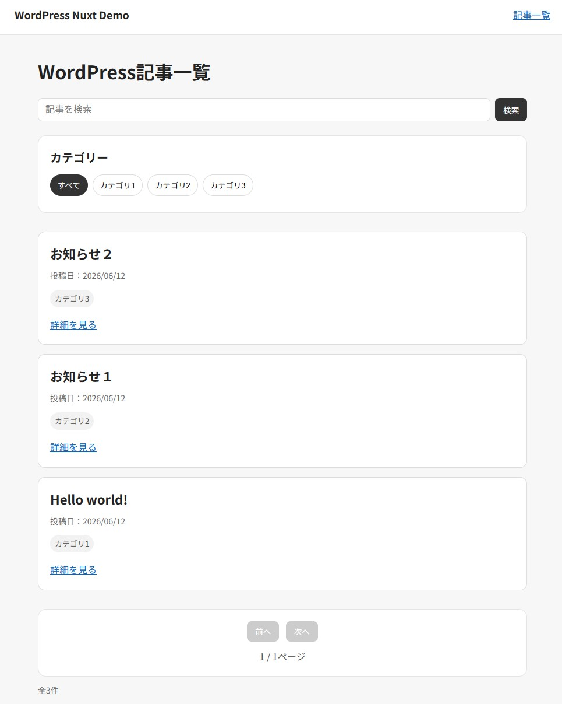
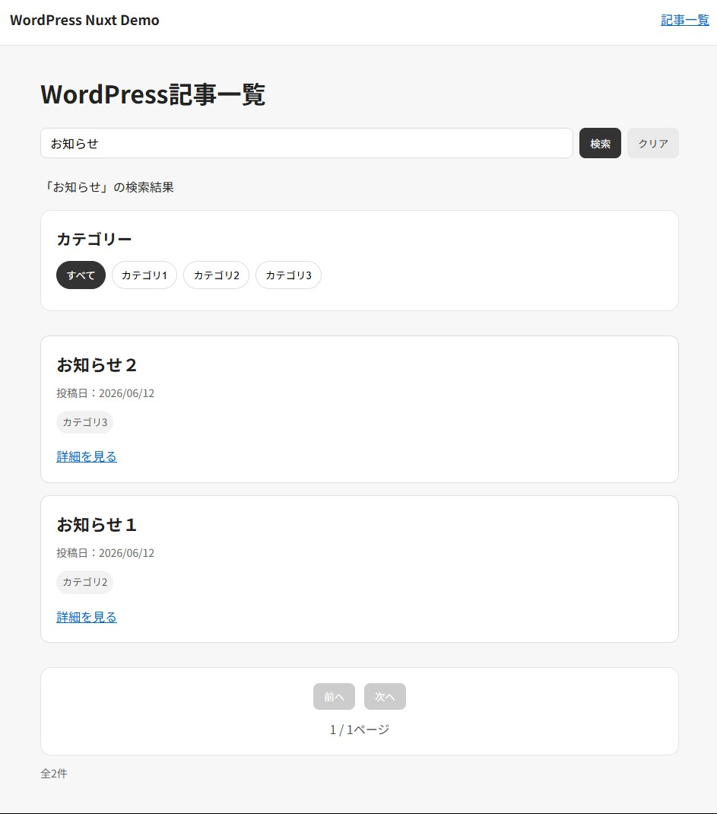

# WordPress Nuxt Demo

WordPressをCMSとして使い、Nuxt.js + TypeScriptで記事一覧・記事詳細・カテゴリ絞り込み・検索・ページネーションを表示する学習用デモです。

### トップページ



### 検索結果




## 概要

このプロジェクトでは、WordPress REST APIから投稿データを取得し、Nuxt側でフロント画面を構築しています。
WordPress側では記事やカテゴリを管理し、Nuxt側では取得したデータをもとに以下の画面を表示します。

- 記事一覧ページ
- 記事詳細ページ
- カテゴリ別記事一覧ページ
- キーワード検索
- ページネーション
- SEO情報設定
- 404 / エラー画面

## 使用技術

- Vue.js
- Nuxt.js
- TypeScript
- WordPress REST API
- Local

## ディレクトリ構成

```txt
wp-nuxt-api-demo/
├─ docs/
│  └─ images/
├─ frontend/
│  ├─ app/
│  │  ├─ assets/
│  │  ├─ components/
│  │  ├─ composables/
│  │  ├─ layouts/
│  │  ├─ pages/
│  │  ├─ types/
│  │  ├─ utils/
│  │  ├─ app.vue
│  │  └─ error.vue
│  ├─ public/
│  ├─ nuxt.config.ts
│  ├─ package.json
│  └─ tsconfig.json
├─ .gitignore
└─ README.md
```

## 起動方法

### 1. WordPressを起動する

LocalでWordPressサイトを起動します。
WordPress REST APIが表示できることを確認します。

```txt
http://localhost:10005/wp-json/wp/v2/posts?per_page=3
```

### 2. .envを作成する

`.env`を作成し、WordPress REST APIのベースURLを設定します。

```env
NUXT_PUBLIC_WP_API_BASE_URL=http://localhost:10005
```

.envはGit管理から除いていますが、学習目的であることと機密情報ではないため掲載しています。

### 3. 依存関係をインストールする

```bash
npm install
```

### 4. 開発サーバーを起動する

```bash
npx nuxi dev --host 127.0.0.1 --port 3001 -o
```

### 5. ブラウザで確認する

```txt
http://127.0.0.1:3001/
```

## 学習ポイント

このデモではWordPress REST APIとNuxt.jsを組み合わせた小規模なHeadless WordPress風サイトを作成しています。

主な学習ポイントは以下です。

### Nuxtの基本構成

- `app.vue`をアプリ全体の入口として使う
- `pages`でページを作る
- `layouts`で共通レイアウトを作る
- `components`でUI部品を分ける
- `composables`で処理を分離する
- `types`でTypeScriptの型定義をまとめる
- `utils`で汎用関数を管理する

### WordPress REST API連携

- WordPressの投稿一覧をREST APIから取得する
- 投稿IDをもとに記事詳細を取得する
- カテゴリ一覧を取得する
- カテゴリIDを使って記事を絞り込む
- WordPress APIのレスポンスにTypeScriptの型を付ける

### Vue / Nuxtの実装理解

- `useFetch`でAPIデータを取得する
- `ref`で変化する値を管理する
- `computed`で表示用データを作る
- `props`で親から子へデータを渡す
- `emit`で子から親へイベントを伝える
- `v-for`で一覧を繰り返し表示する
- `v-if`/ `v-else-if`/ `v-else`で状態に応じた表示を切り替える
- `NuxtLink`でページ遷移を行う

### URLクエリ管理

- `useRoute`で現在のURL情報を取得する
- `useRouter`でURLを変更する
- `?search=キーワード`で検索状態を管理する
- `?category=カテゴリID`でカテゴリ条件を管理する
- `?page=ページ番号`でページ番号を管理する
- URLを再読み込みしても検索・絞り込み状態が残るようにする

### 実務寄りの整理

- API取得処理を`composables`に分離する
- 型定義を`types`にまとめる
- 日付整形やHTMLテキスト化を`utils`に分ける
- 検索フォーム、カテゴリ一覧、ページネーション、メッセージ表示をコンポーネント化する
- 共通CSSを`assets/css/main.css`にまとめる
- エラー画面を`error.vue`で用意する
- `useSeoMeta`でページごとのtitle / descriptionを設定する

## 制作目的

WordPressの知見があるため、それを活かしたフロントエンド開発をしたいと思い、WordPressをCMSとして利用し、Nuxt.js + TypeScriptでフロントエンドを構築する構成を学習するために制作しました。

WordPress側では投稿・カテゴリなどのコンテンツ管理を担当し、Nuxt側ではREST APIから取得したデータをもとに画面表示を行います。

WordPressの管理画面を活かしつつ、フロントエンド側はVue / Nuxtのコンポーネント設計、ルーティング、検索、ページネーション、SEO設定などを分離して実装できます。